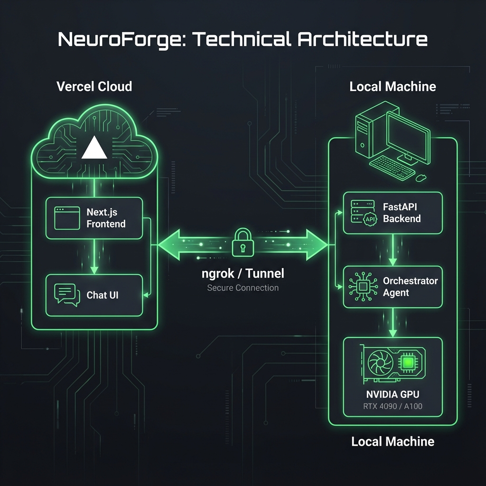

# NeuroForge

**NeuroForge** is a sovereign AI fine-tuning studio. It provides a sleek, ChatGPT-style interface (hosted on Vercel or locally) that connects to a **local Python Orchestrator** running on your GPU machine.


## Architecture



*   **Frontend**: Next.js 14+ (App Router, Tailwind CSS, Shadcn/UI).
*   **Backend**: Python FastAPI (Runs locally on your training machine).
*   **Orchestrator**: The backend acts as an agent, using a local LLM to interpret your commands ("Train Llama 3 on my dataset") and execute training scripts.

## 🚀 Getting Started

### Prerequisites

*   Node.js 18+
*   Python 3.10+
*   NVIDIA GPU (Recommended for training) or Apple Silicon (Mac M1/M2/M3).

### 1. Backend Setup (Local Machine)

The backend handles the "brains" and the heavy lifting.

```bash
cd backend
pip install -r requirements.txt
```

**Configuration:**
Open `backend/config.py` and set the path to your local orchestrator model:

```python
# backend/config.py
ORCHESTRATOR_MODEL_PATH = "/path/to/your/local/model.gguf" 
# Or set to "MOCK_MODE" to test the UI without a GPU.
```

**Run Server:**
```bash
python main.py
# Server will start at http://0.0.0.0:8000
```

### 2. Frontend Setup

You can run the frontend locally or deploy to Vercel.

**Local Run:**
```bash
# In the root directory (where package.json is)
npm install
npm run dev
# Open http://localhost:3000
```

**Vercel Deployment:**
1.  Push this repo to GitHub.
2.  Import into Vercel.
3.  **Important**: Ensure the project Root Directory is set correctly (it should be the repository root).
4.  **Connecting to Local Backend**:
    *   Since Vercel is on the cloud and your backend is local, you need a **Tunnel**.
    *   Use **ngrok**: `ngrok http 8000`
    *   Update the frontend's API URL in `lib/api.ts` (currently hardcoded to `http://localhost:8000`).

## 🛠 Features

*   **Chat Interface**: Interact with your infrastructure using natural language.
*   **Local Control**: Your data and models never leave your machine.
*   **Adaptive UI**: Works on Desktop and Mobile.
*   **Extensible**: Add new training scripts in `backend/` and register them in the Orchestrator.

## 🤝 Contributing

Pull requests are welcome. For major changes, please open an issue first to discuss what you would like to change.
